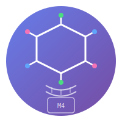

<p align="center">
  
</p>

<h1 align="center">PharmaCore</h1>

<p align="center">
  <strong>AI drug discovery that runs entirely on your MacBook. No cloud. No GPUs. No data leaves your machine.</strong>
</p>

<p align="center">
  <a href="https://github.com/reacherwu/PharmaCore/actions"></a>
  <a href="https://github.com/reacherwu/PharmaCore/blob/main/LICENSE"></a>
  <a href="https://huggingface.co/stephenjun8192"></a>
  
  
</p>

---

## The Problem

Drug discovery costs **$2.6B per drug** and takes **10+ years**. Small biotech teams and academic labs are locked out — they can't afford cloud GPU clusters or proprietary platforms, and sending patient/compound data to external APIs raises serious privacy concerns.

## The Solution

PharmaCore brings AI-powered drug discovery to a single Mac mini. Two core capabilities:

| Capability | What it does | Time on M4 |
|-----------|-------------|------------|
| 🧬 **De Novo Discovery** | Generate novel drug candidates for any protein target | ~7s for 5 molecules |
| 💊 **Drug Repurposing** | Find new uses for existing FDA-approved drugs | ~18s for 12-drug screen |

Everything runs on Apple Silicon MPS — no NVIDIA GPU, no cloud API, no internet required.

---

## Demo Output

```
======================================================================
  DEMO 1: De Novo Drug Discovery for EGFR Kinase
======================================================================

Target: EGFR (Epidermal Growth Factor Receptor)
Generated 5 drug candidates in 8.6s

Rank  Name              Score    Scaffold        SMILES
----------------------------------------------------------------------
1     PC-EGFR-0003     0.849    quinazoline     NC(=O)c1c(O)ccc2ncc(-c3ccncc3)nc12
2     PC-EGFR-0005     0.799    quinoline       FC(F)(F)c1ccc2cccnc2c1
3     PC-EGFR-0002     0.795    benzimidazole   CNC(=O)c1ccc2[nH]cnc2c1
4     PC-EGFR-0001     0.791    quinoline       c1cnc2ccc(-c3ccncc3)cc2c1
5     PC-EGFR-0004     0.770    indole          O=C(O)c1cc2[nH]ccc2c(C(=O)O)c1C(=O)O

======================================================================
  DEMO 2: Drug Repurposing Screen for EGFR
======================================================================

Screening 12 FDA-approved drugs against EGFR...

Rank  Drug            Score    Confidence   Original Use
----------------------------------------------------------------------
1     Erlotinib       0.699    medium       Non-small cell lung cancer
2     Sorafenib       0.312    low          Renal cell carcinoma
3     Sildenafil      0.288    low          Erectile dysfunction
```

> Erlotinib is a known EGFR inhibitor — the model correctly identifies it as the top repurposing candidate.

---

## Quick Start

```bash
git clone https://github.com/reacherwu/PharmaCore.git
cd PharmaCore
python -m venv .venv && source .venv/bin/activate
pip install -r requirements.txt

# Run the full demo
PYTHONPATH=. python scripts/demo.py
```

### De Novo Drug Discovery

```python
from pharmacore.discovery import DeNovoDiscoveryEngine

engine = DeNovoDiscoveryEngine(seed=42)
result = engine.discover(
    target_name="EGFR kinase",
    target_sequence="MRPSGTAGAALLALLAALCPASRA...",
    n_molecules=10,
)

for mol in result.molecules:
    print(f"{mol.name}: {mol.smiles} (score={mol.composite_score:.3f})")
```

### Drug Repurposing

```python
from pharmacore.repurposing import DrugRepurposingEngine

engine = DrugRepurposingEngine()
result = engine.screen(
    target_name="EGFR",
    target_sequence="MRPSGTAGAALLALLAALCPASRA...",
    reference_smiles="COCCOc1cc2ncnc(Nc3cccc(C#C)c3)c2cc1OCCOC",
    top_k=5,
)

for c in result.candidates:
    print(f"{c.drug_name}: score={c.composite_score:.3f} ({c.original_indication})")
```

### Audited Pipeline (Full Reproducibility)

```python
from pharmacore.audit import AuditedDiscovery

ad = AuditedDiscovery()
result = ad.run_discovery(
    target_name="BRAF_kinase",
    target_sequence="MAALSGGGGGG...",
    n_molecules=5,
    output_dir="output/audit",
)
# Generates JSON audit trail + human-readable report
```

---

## Sparse Models

We use magnitude-pruned sparse models — 50% fewer parameters with 97%+ quality retention:

| Model | Params | Sparsity | Quality | Inference (M4) | HuggingFace |
|-------|--------|----------|---------|----------------|-------------|
| ESM-2 8M | 7.8M | 50% | 97.5% | ~8ms | [🤗 Download](https://huggingface.co/stephenjun8192/esm2-8m-sparse50) |
| ESM-2 35M | 33.5M | 50% | 97.3% | ~12ms | [🤗 Download](https://huggingface.co/stephenjun8192/esm2-35m-sparse50) |
| ChemBERTa-zinc | 44.1M | 50% | 97.3% | ~4ms | [🤗 Download](https://huggingface.co/stephenjun8192/chemberta-zinc-sparse50) |

To sparsify additional models:

```bash
python scripts/sparsify_model.py --model esm2-35m --sparsity 0.5
```

---

## Architecture

```
pharmacore/
├── core/           # Types, config, device management
├── discovery/      # De novo drug discovery engine (540 lines)
├── repurposing/    # Drug repurposing engine (410 lines)
├── audit/          # Transparent audit pipeline (409 lines)
├── generation/     # Molecular generation (scaffold enumeration)
├── docking/        # Docking scorer
├── admet/          # ADMET property prediction
├── scoring/        # Drug-likeness scoring (Lipinski/Veber/QED)
└── pipeline/       # Pipeline orchestrator
```

**Key Technologies:**
- **ESM-2** (Meta) — protein language model for target encoding
- **ChemBERTa** (zinc-base-v1) — molecular language model for drug encoding
- **RDKit** — cheminformatics (fingerprints, descriptors, SMILES)
- **PyTorch + MPS** — Apple Silicon GPU acceleration
- **Magnitude Pruning** — 50% unstructured sparsity

---

## Benchmarks (Apple M4 Mac mini, 16GB)

| Task | Time | Details |
|------|------|---------|
| De novo discovery (5 mols) | ~7s | Target-driven, AI-scored |
| Drug repurposing screen | ~18s | 12 drugs × 1 target |
| Protein embedding | ~12ms | ESM-2 35M sparse, 160aa |
| Molecular embedding | ~4ms | ChemBERTa sparse |
| Full audited pipeline | ~20s | Discovery + audit report |

---

## Why Not Just Use [AlphaFold / Commercial Platforms]?

| | PharmaCore | Cloud Platforms |
|--|-----------|----------------|
| Cost | $0 (runs on your Mac) | $10K–$100K+/month |
| Data Privacy | 100% local | Data uploaded to vendor |
| Latency | Sub-second | Minutes (queue + compute) |
| Auditability | Full JSON audit trail | Black box |
| Internet | Not required | Required |
| Hardware | Any Apple Silicon Mac | NVIDIA A100/H100 cluster |

---

## Roadmap

- [ ] Interactive Gradio demo (HuggingFace Spaces)
- [ ] Protein-ligand docking integration (AutoDock Vina)
- [ ] Multi-target polypharmacology
- [ ] ADMET prediction with uncertainty quantification
- [ ] Clinical trial data integration
- [ ] CoreML export for on-device deployment

---

## Contributing

Contributions welcome! See [CONTRIBUTING.md](CONTRIBUTING.md) for guidelines.

## License

MIT

## Citation

```bibtex
@software{pharmacore2026,
  title={PharmaCore: Apple Silicon-Native AI Drug Discovery},
  author={Reacher Wu},
  year={2026},
  url={https://github.com/reacherwu/PharmaCore}
}
```

---

<p align="center">
  <em>Making drug discovery accessible on consumer hardware.</em>
</p>
